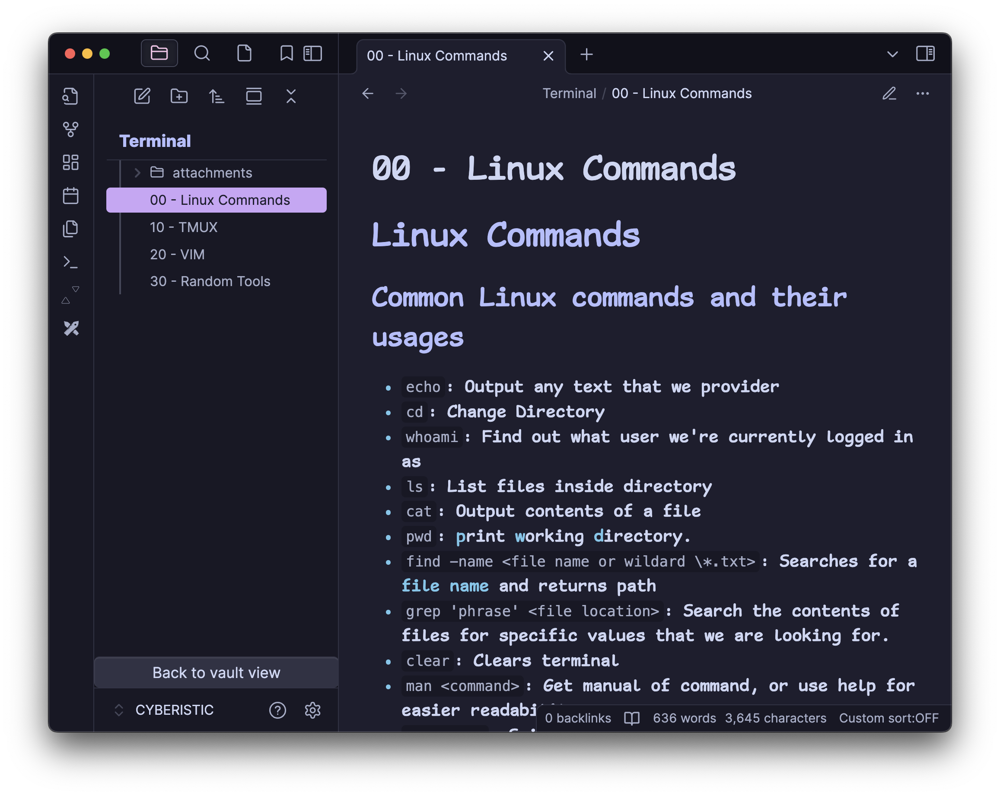

# Isolate Folder

A plugin for Obsidian that allows you to focus on a single folder by temporarily hiding the rest of your vault structure. Similar to "Open Folder" in other apps such as VS Code.
Useful for focusing on a single folder, recording/streaming, or if you don't want others to see your notes while in public or presenting.

I created this because I give lectures using Obsidian, and I don't want students to see my entire vault.

## Features

-   Right-click any folder to open it in isolated view
-   Clear, uncluttered view of folder contents
-   Easy navigation back to full vault view
-   Context menu (right-click) on header to exit isolated view
-   Button at bottom to return to full vault view
-   Command palette support for exiting isolated view

## How to Use

1. Right-click any folder in your vault
2. Select "Open in Isolated View"
3. The folder's contents will be shown in isolation
4. To return to the full vault view, you have a few options:
    - Right-click the folder name in the header
    - Click the "Back to vault view" button at the bottom
    - Use the command palette and select "Exit Isolated View"

## Installation

### From Obsidian Community Plugins

1. Open Settings in Obsidian
2. Navigate to Community Plugins
3. Search for "Isolate Folder"
4. Click Install
5. Click Enable

### Manual Installation

1. Download the latest release (git clone https://github.com/Cyberistic/obsidian-isolate-folder)
2. Copy folder to your vault's `.obsidian/plugins` directory
3. Reload Obsidian
4. Enable the plugin in Settings → Community Plugins

## Known Issues

This plugin works well enough for me, however its functionality could be improved! I noticed a few issues during development, If there is interest I will try my best to solve them.

-   Nested folder isolation: When isolating a folder while already in an isolated view, child folders don't show properly. Currently, I disabled the option to isolate while in isolated view, you have to go back to vault view first then isolate the nested folder.

-   Folder expansion: Children of folders are hidden by default, you need to "expand" the folder to view its children. We're using `.click()` on folders to make sure they're expanding before isolation, which isn't ideal. Should use a more native approach to manipulate the DOM directly.

-   File rerendering: When returning to the main view, we need to collapse folders to force a rerender of children. Just like the previous issue, we are collapsing the folder on return to the vault view using `.click()`.

-   Menu options: Right clicking the title of the isolated folder, or empty space, should bring the default folder menu options. Right now, right clicking empty space brings "Create Note" and "Create Option" which create in vault root instead of isolated folder.

PRs are welcome! If you'd like to help fix these issues or add new features, please check out the [GitHub repository](https://github.com/Cyberistic/obsidian-isolate-folder) :)

## License

MIT
